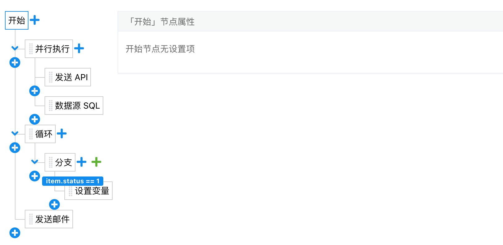
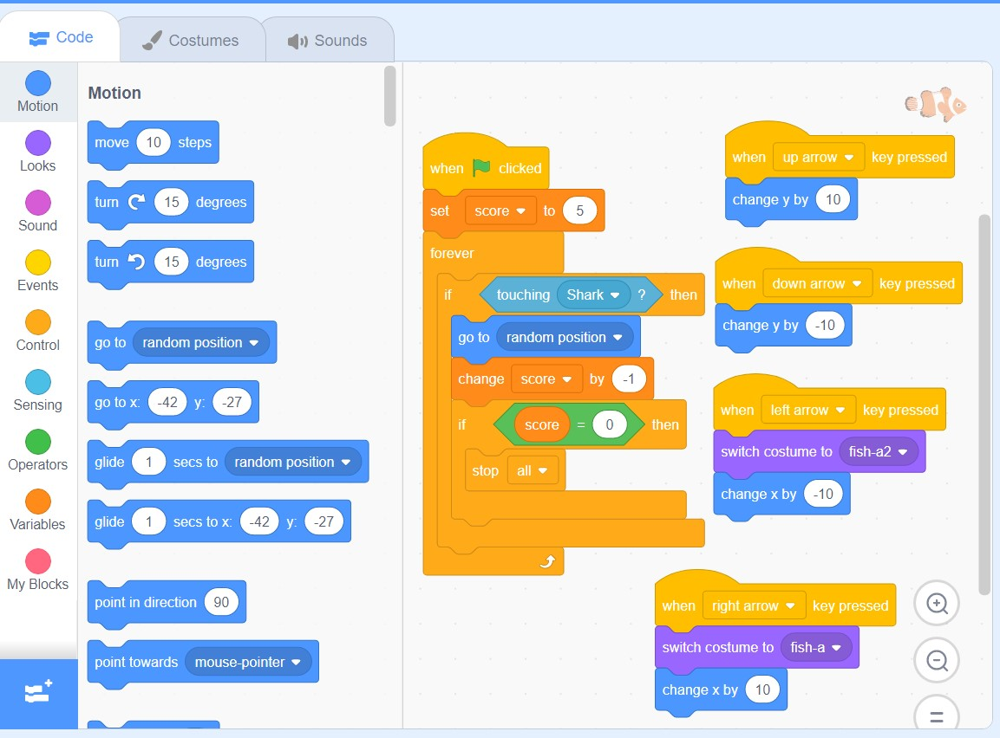

# Yutu DSL 语法

## 简介
Yutu DSL 是一种声明式语法的语言，可以用于不复杂的接口聚合及增删改查场景。  
Yutu DSL 长期的目标是用可视化的方式来编写后端代码。  
  
示意图：  


Scratch

## 基础语法
**行与缩进：**  
Yutu DSL 使用缩进来表示代码块，不需要使用大括号 "{}"，也没有换行符 ";"  
缩进的空格数是可变的，但是同一个代码块的语句必须包含相同的缩进空格数  
  
示例：  
```
- if: false
  then:
  - println("in if body")
- else:
  - println("in else body")
```
  
**空行：**  
语句之间可以用空行分隔，表示一段新的代码的开始。空行与代码缩进不同，空行并不是 Yutu DSL 语法的一部分。  
  
**顺序执行：**  
语句以"- "开头，同一个代码块的语句（必须包含相同的缩进空格数），会至上而下顺序执行  
  
示例：  
```
- print("hello world!")
- print("hello world!")
```
  
**基本语法：**  
每一行代码 "- " 之后的语句，分为两类：  
- 普通语法，语法与 AviatorScript 基本语法相同，参考：https://www.yuque.com/boyan-avfmj/aviatorscript/rcx4q0  
- 逻辑引擎 Action 的 name，会触发 对应Action 的执行  
  
## 条件控制
Yutu DSL 条件语句是通过一条或多条语句的执行结果（True 或者 False）来决定执行的代码块。  
  
### if 语句
Yutu DSL 中 if 语句的一般形式如下所示：  
```
- if: condition_1
  then:
  - statement_1
  - statement_2
- elif: condition_2
  then:
  - statement_3
  - statement_4
- else:
  - statement_5
  - statement_6
```
  
* 如果 "condition_1" 为 True 将执行 "statement_1" 和 "statement_2" 语句
* 如果 "condition_1" 为False，将判断 "condition_2"
* 如果"condition_2" 为 True 将执行 "statement_3" 和 "statement_4" 块语句
* 如果 "condition_2" 为False，将执行 "statement_5" 和 "statement_6"语句
  
Yutu DSL 中用 elif 代替了 else if，所以if语句的关键字为：if – elif – else。  
  
以下是一个简单的 if 示例：  
```
- if: a > 1000
  then:
  - println("a is greater than 1000.")
- elif: a > 100 
  then:
  - println("a is greater than 100.")
- elif: a > 10
  then:
  - println("a is greater than 10.")
- else:
  - println("a is less than 10 ")
```
  
### if 嵌套
在嵌套 if 语句中，可以把 if...elif...else 结构放在另外一个 if...elif...else 结构中。  
```
- if: 表达式1
  then:
  - 语句
  - if: 表达式2
    then:
    - 语句
  - elif: 表达式3
    then:
    - 语句
  - else:
    - 语句
- elif: 表达式4
  then:
  - 语句
- else:
  - 语句
```
  
示例：  
```
- if: num%2==0
  then:
  - if: num%3==0
    then:
    - print ("你输入的数字可以整除 2 和 3")
  - else:
    - print ("你输入的数字可以整除 2，但不能整除 3")
- else:
  - if: num%3==0
    then:
    - print ("你输入的数字可以整除 3，但不能整除 2")
  - else:
    - print  ("你输入的数字不能整除 2 和 3")
```

## 循环语句
Yutu DSL 中的循环语句有 for 和 while。  
  
### while 循环
Yutu DSL 中 while 语句的一般形式：  
```
- while: 判断条件(condition)
  do:
  - 执行语句(statement)
  - 执行语句(statement)
  - ……
```
  
以下实例使用了 while 来计算 1 到 100 的总和：  
```
- let n = 100
- let sum = 0
- let counter = 1
​
- while: counter <= n
  do:
  - sum = sum + counter
  - counter += 1
```
  
注意：Yutu DSL 的循环不支持 break 和 continue 语句。  
  
### for 语句
Yutu DSL for 循环可以遍历任何可迭代对象，如一个列表或者一个字符串。  
  
for循环的一般格式如下：  
```
- for: <variable> in <sequence>
  do:
  - <statements>
```
  
for ... in 语句通常用于遍历一个集合，例如下面是遍历 0 到 9 的数字，并打印：  

**range() 函数：**  
如果需要遍历数字序列，可以使用内置range()函数，它会生成数列。  
  
```
- for: i in range(0, 10)
  do:
  - println(i)
```
  
注意：Yutu DSL 的循环不支持 break 和 continue 语句。  
  
for .. in 可以用于任何集合结构，比如数组、 java.util.List 、 java.util.Map 等等：  
  
```
- let sum = 0
- for: x in list
  do:
  - sum = sum + x
```
  
### 循环嵌套
在嵌套循环语句中，可以把 while/for 结构放在另外一个 while/for 结构中。  
  
## 并行执行
Yutu DSL 语言支持并发，只需要通过 go 关键字来开启并发即可。  
```
- go:
  - <statement(s)>
```
  
示例：  
```
- go: 
  - print("world")
- print("hello")
- go: 
  - print("world")
- print("hello")
```